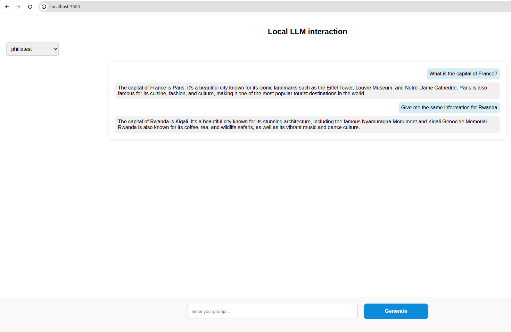

**Description**

The point of this project is to add a frontend to make it possible to interact with a LLM locally through a chat. 
Ollama is used to run a model locally. 

The frontend was built using nodejs framework. 


**How to use it** 

The project works only on Linux distributions at the moment. Indeed, Ollama is only available for Linux, macOS and Windows WSL. Also, macOS and WSL have not been tested.  

1. Make sure to have [Ollama](https://github.com/jmorganca/ollama) and [nodejs](https://nodejs.org/en/download/package-manager) installed on your Linux environment.
2. Download at least one model using Ollama API (below, Phi is the lightest model), and launch ollama (it may be launched by default when requested depending on your OS): 
```bash
$ ollama pull phi 
$ ollama serve
```
3. Clone the repository locally : 
```bash
$ git clone git@github.com:thomasaurousseau-coding/llm-chatbot-interface.git
```
4. Go to the frontend directory, and install the npm dependencies : 
```bash
$ cd frontend
$ npm install
```
5. Launch the server with the following terminal command : 
```bash
$ cd frontend
$ node app.js 
```
6. Connect to the port 3000 of your localhost on your browser (app tested on Chrome 120.0.6099.129 (Official Build) (64-bit)) : http://localhost:3000/.
7. You can now try to interact with the models that you have installed locally ! 


**Current limitations** 

Limitations : 
- No history is stored, as no database connector have been implemented. 
